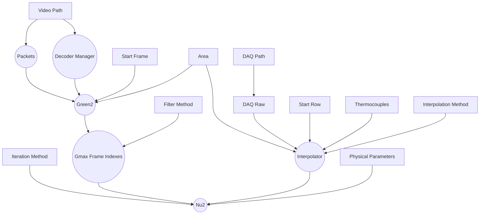
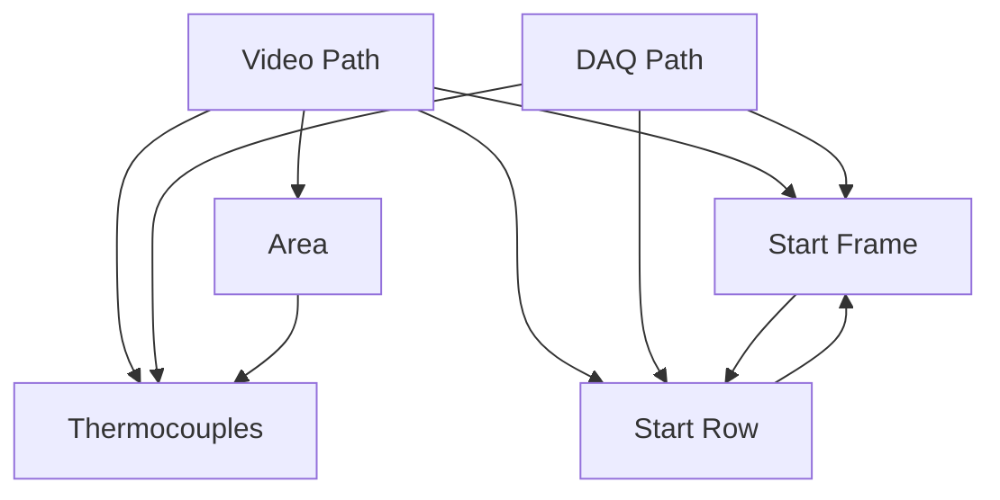
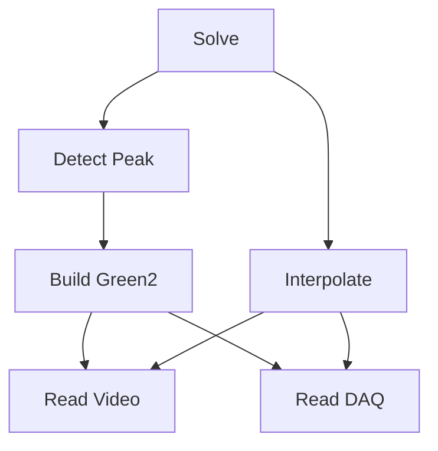

# Transient Liquid Crystal Experiment Data Processing

Built with [Tauri](https://tauri.app).
- [x] Backend, Rust, almost done
- [ ] Frontend, TypeScript, will start soon 

## User Manual
todo

## Development
### On Linux
- install rust nightly-x86_64-unknown-linux-gnu toolchain
- install [Nix](https://nixos.org/) and enable [Flake](https://nixos.wiki/wiki/Flakes), this will manage all other dependencies
```sh
# enter the environment
nix develop # or use direnv
```
- [ ] cross compile to Windows

### On Windows
- make sure your windows support [WebView2](https://developer.microsoft.com/en-us/microsoft-edge/webview2/)
- install rust nightly-x86_64-pc-windows-msvc toolchain
- install tauri-cli, cargo-nextest
- install `ffmpeg` via `vcpkg`, need to compile for about 20 mins
- let `vcpkg` expose `ffmpeg` headers and DLLs
- install `cargo-vcpkg`
- install `LLVM`

---
```sh
# unit test
cargo nextest run 

# integration test(need real experiment data)
cargo nextest run --run-ignored all

# run
cargo tauri dev

# build
cargo tauri build
```

## Architecture
### `Data = f(Setting)`
`Setting`为由用户指定的设置，`Data`为计算结果。

整体上是pure evaluation，程序完成`Setting`到`Data`的映射，即同样的`Setting`得到同样的`Data`。

具体实现上：
- `Setting`有多项，`Data`有多个中间结果
- `Data`的不同中间结果分别依赖`Setting`中的不同项
- `Setting`中的不同项之间也存在依赖关系

整个计算过程可以看作是**实际**`Data`向**当前**`Setting`所**映射**的`Data`动态收敛的过程。

在用户逐步构建`Setting`的过程中，软件需要满足：
- Best Efforts. 对于不完整`Setting`，需要尽可能的计算出所有已经**可以计算**的中间结果
- Correctness. 当`Setting`项变化时，invalidate依赖该项的所有中间结果并重新计算
- Eager & Declarative. 用户只负责修改设置，所有计算任务均自动触发：
    - 没有依赖关系的任务并行化
    - 排除重复任务
    - 取消已经因为`Setting`变化而不需要继续的任务

`Data`对`Setting`的依赖关系如下图（方框：`Setting`，圆框：`Data`）：


`Setting`内部各项之间的依赖如下图：


任何一项`Setting`改变，所以与其关联的`Setting`项都需要更新，进而所有依赖这些`Setting`项的下游`Data`都需要重新计算。

### 多线程下的状态管理
全局状态`GlobalState`为`Setting`和`Data`的总和。

1. 操作`GlobalState`时需要保证独占，且由于`GlobalState`内不同模块的依赖关系较为复杂，不考虑拆分独占的粒度
2. 为了保证系统responsive，所有耗时任务(I/O & CPU-bound task)在任务执行过程中都必须放弃对于`GlobalState`的独占

因此耗时任务的生命周期可以分为三个阶段：
1. 根据当前状态生成任务执行计划
```rust
// lock
let input = eval_task(&global_state);
// unlock
```
2. 执行任务
```rust
let output = execute(input);
```
3. 根据任务执行的结果修改`GlobalState`，但由于计算过程中放弃了独占，`GlobalState`可能已经被修改，需要检查任务条件是否变化
```rust
// lock
check(&global_state, input);
update(&mut global_state, output);
// unlock
```
- `execute`是pure function，且只需要domain knowledge，便于测试
- `eval_task`, `check`和`update`也是pure function，由于不涉及实际计算，`GlobalState`的mock很容易（大部分只需要设置是否存在，而不需要mock一个真实的数据）
- 临界区内只有简单数据读写，不会成为整个系统瓶颈，耗时任务的执行完全并行

`GlobalState`的独占可以通过`lock`或者`channel`实现，在完整实现完两种方案后我决定采用以`channel`为核心的架构。总体来说，`channel`/`event` based architecture虽然会有更多的boilerplate（即使rust对于ADT有很好的支持），但更容易将状态操作和多线程相关的代码隔离，保证大部分函数都是简单串行，无副作用的，即Data-oriented Design，可以参考
- [Data as a mediator between computation and state](https://www.tedinski.com/2018/08/28/using-data-to-mutate-state.html)
- [How I structure my apps (in Rust and other languages)](https://dpc.pw/how-i-structure-my-apps-in-rust-and-other-languages)

具体实现为：

1. 主线程为单一事件循环，通过`Request Channel`监听来自用户的事件
2. 主线程只负责读写`GlobalState`以及根据当前状态生成任务计划并spawn `worker`线程执行
3. `worker`线程仅持有其任务所需的数据（`GlobalState`的子集及其衍生物），size较小的数据copy，较大的通过线程安全的引用计数获得一个只读引用。任务执行完成后将结果以及该结果的条件发送到`Output Channel`
4. 主线程同时监听(`select`)`Output Channel`，收到`Output`后，根据结果的条件与当前`GlobalState`检验，如果结果依然有效则修改状态，否则丢弃


### 生成计算任务执行计划
计算依赖图：

依赖图用二维数组表示。每一个节点有0或多个前置节点，当所有前置节点都已计算完毕，则根据当前`GlobalState`求值该节点的任务执行计划：
```rust
enum TaskState {
    AlreadyCompleted,
    ReadyToGo(Task),
    DispatchedToOthers,
    CannotStart { reason: String },
}

fn eval_task(&GlobalState) -> TaskState
```
当前置节点未完成计算时，`eval_task`不需要执行，因此是惰性求值：
```rust
struct LazyEvaluator<'a> {
    eval: &'a dyn Fn() -> TaskState,
    value: Option<TaskState>,
}
```
从终节点递归遍历得到当前所有可以执行的任务执行计划`Task`。在判断前置条件时不短路返回，即可得出多个互不依赖的任务，这些任务将并行执行。

当有主事件循环接收到：

1. 写操作的`Request`并成功修改了状态
2. 仍然有效的`Output`并成功修改了状态

时会触发一次`reconcile`，调用`eval_task`得到available的`Task`并为每一个`Task`开一个worker线程：
```rust
for task in global_state.eval_tasks() {
    global_state.spawn_execute_task(task);
}
```

`TaskRegistry`负责控制不产生重复的无效任务，每个任务在执行前都会包含计算条件的
```rust
struct TaskRegistry {
    last_task_ids: [Option<Arc<TaskId>>; NUM_TASK_TYPES],
}
```

总：


### 其他

- 丝滑进度条
When user drags the progress bar quickly, the decoding can not keep up and there will be a significant lag. Actually, we do not have to decode every frames, and the key is how to give up decoding some frames properly. The naive solution to avoid too much backlog is maintaining the number of pending tasks and directly abort current decoding if it already exceeds the limit. But FIFO is not perfect for this use case because it's better to give priority to newer frames, e.g. we should at least guarantee decoding the frame where the progress bar **stops**.
    ```rust
    ring_buffer: ArrayQueue<(Packet, oneshot::Sender<T>)>,
    task_dispatcher: Sender<()>,
    ```
    `task_dispatcher`是有界`spmc`用于把任务分发多个worker，利用`try_send`满了立即失败来abort多余的任    务。但消息不能放在队列里，因为FIFO不满足需求，需要一个`ring_buffer`存放实际的消息，淘汰掉的消息就是 最旧的。

- 不要试图实现同步取消，会变得不幸
- 充分利用RAII，优先采用状态的销毁和重建，而非维护和复用
- 计算进度监控，`AtomicI64`，高32记录`total`，低32记录`count`，同时用于取消busy loop

## References
- [Taking Advantage of Auto-Vectorization in Rust](https://www.nickwilcox.com/blog/autovec)
- [Async: What is blocking?](https://ryhl.io/blog/async-what-is-blocking/)
- [FFmpeg: Difference Between Frames and Packets](https://stackoverflow.com/questions/53574798/difference-between-frames-and-packets-in-ffmpeg)
- [FFmpeg: multithread decoding](https://www.cnblogs.com/TaigaCon/p/10220356.html)
- [Matklad's reply on reddit](https://www.reddit.com/r/rust/comments/uf7yoy/comment/i6s4b8x/)
