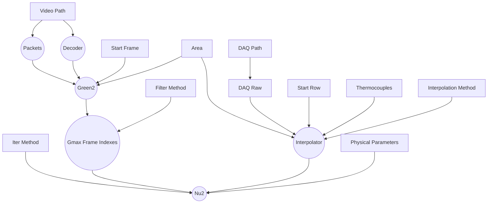
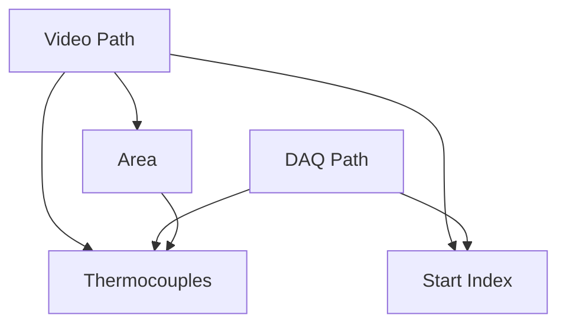

# Transient Liquid Crystal Experiment Data Processing

## Development
### Linux
- install rust nightly-x86_64-unknown-linux-gnu toolchain
- install [Nix](https://nixos.org/) and enable [Flake](https://nixos.wiki/wiki/Flakes), this will manage all other dependencies.
```sh
# enter the environment
nix develop # or use direnv
```
Cross compile to Windows(TODO).

### Windows(TODO)
- install rust nightly-x86_64-pc-windows-msvc toolchain
```sh
# install `ffmpeg` via `vcpkg`, need to compile for about 20 mins

# let vcpkg expose ffmpeg headers

# install `llvm`

# install `cargo-vcpkg`
```

## Architecture


Some `input`s depend on others, these relationships need to be maintained manually.



### Misc

#### Smooth Progress Bar
When user drags the progress bar quickly, the decoding can not keep up and there will be a significant lag. Actually, we do not have to decode every frames, and the key is how to give up decoding some frames properly. The naive solution to avoid too much backlog is maintaining the number of pending tasks and directly abort current decoding if it already exceeds the limit. But FIFO is not perfect for this use case because it's better to give
priority to newer frames, e.g. we should at least guarantee decoding the frame where the progress bar **stops**.
`ring_buffer` is used to automatically eliminate the oldest frame to limit the
number of backlog frames.
```rust
thread_pool: ThreadPool,
ring_buffer: ArrayQueue<oneshot::Sender<T>>,
sem: Semaphore,
```

## References
- [Taking Advantage of Auto-Vectorization in Rust](https://www.nickwilcox.com/blog/autovec)
- [Async: What is blocking?](https://ryhl.io/blog/async-what-is-blocking/)
- [FFmpeg: Difference Between Frames and Packets](https://stackoverflow.com/questions/53574798/difference-between-frames-and-packets-in-ffmpeg)
- [FFmpeg: multithread decoding](https://www.cnblogs.com/TaigaCon/p/10220356.html)
- [Matklad's reply on reddit](https://www.reddit.com/r/rust/comments/uf7yoy/comment/i6s4b8x/)
