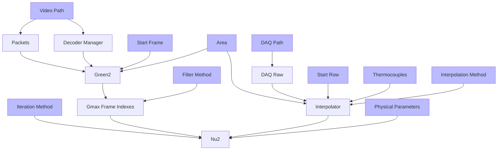
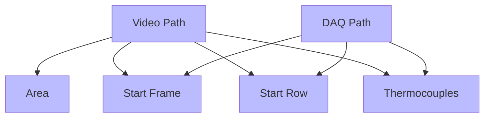

# Transient Liquid Crystal Experiment Data Processing

Built with [Tauri](https://tauri.app).

## Architecture


## Data Dependencies
### Setting Mapping to Runtime Data 


### Logic Dependencies within Setting



## Development
### Linux
First you need to installed [Nix](https://nixos.org/) and enable [Flake](https://nixos.wiki/wiki/Flakes).
```bash
# enter the environment
nix develop # or use direnv

# run
cargo tauri dev

# build
cargo tauri build
```
Cross compile to Windows(TODO).

### Windows(TODO)
```sh
# install rust x86_64-pc-windows-msvc toolchain

# install tauri-cli
cargo install tauri-cli

# install `ffmpeg` via `vcpkg`, need to compile for about 20 mins

# let vcpkg expose ffmpeg headers

# install `llvm`

# install `cargo-vcpkg`
```

## References
- [Taking Advantage of Auto-Vectorization in Rust](https://www.nickwilcox.com/blog/autovec)
- [Async: What is blocking?](https://ryhl.io/blog/async-what-is-blocking/)
- [FFmpeg: Difference Between Frames and Packets](https://stackoverflow.com/questions/53574798/difference-between-frames-and-packets-in-ffmpeg)
- [FFmpeg: multithread decoding](https://www.cnblogs.com/TaigaCon/p/10220356.html)
- [Data as a mediator between computation and state](https://www.tedinski.com/2018/08/28/using-data-to-mutate-state.html)
- [Matklad's reply on reddit](https://www.reddit.com/r/rust/comments/uf7yoy/comment/i6s4b8x/)
