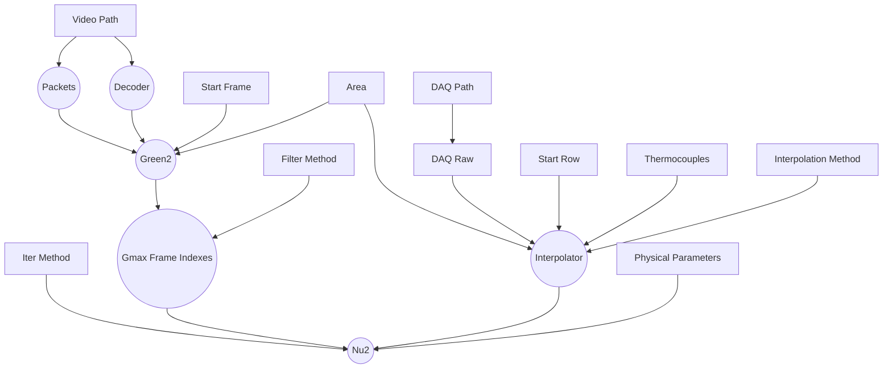
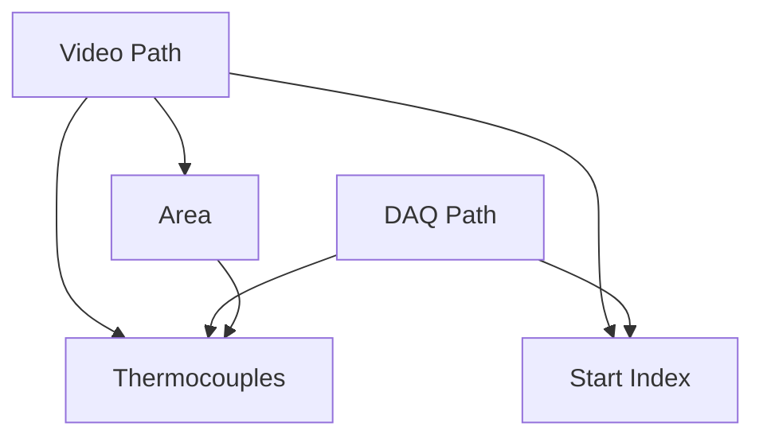

# Transient Liquid Crystal Experiment Data Processing

## Development
### Linux
- install rust nightly-x86_64-unknown-linux-gnu toolchain
- install [Nix](https://nixos.org/) and enable [Flake](https://nixos.wiki/wiki/Flakes), this will manage all other dependencies.
```sh
# enter the environment
nix develop # or use direnv
```
Cross compile to Windows(TODO).

### Windows(TODO)
- install rust nightly-x86_64-pc-windows-msvc toolchain
```sh
# install `ffmpeg` via `vcpkg`, need to compile for about 20 mins

# let vcpkg expose ffmpeg headers

# install `llvm`

# install `cargo-vcpkg`
```

## Architecture


Some `input`s depend on others, these relationships need to be maintained manually.

