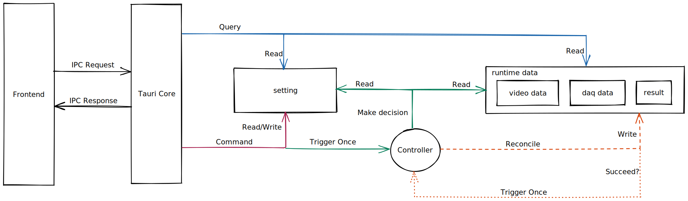

# Transient Liquid Crystal Experiment Data Processing

## Architecture
Built with [Tauri](https://tauri.app)

## Development
```bash
# environment
nix develop # or use direnv

# unit test
cargo nextest run

# include integration test, need real data
cargo nextest run --no-capture --run-ignored all

# bench
cargo bench
```

## Tmp Notes
- [Taking Advantage of Auto-Vectorization in Rust](https://www.nickwilcox.com/blog/autovec)
- [Async: What is blocking?](https://ryhl.io/blog/async-what-is-blocking/)
- [FFmpeg: Difference Between Frames and Packets](https://stackoverflow.com/questions/53574798/difference-between-frames-and-packets-in-ffmpeg)
- [FFmpeg: multithread decoding](https://www.cnblogs.com/TaigaCon/p/10220356.html)


