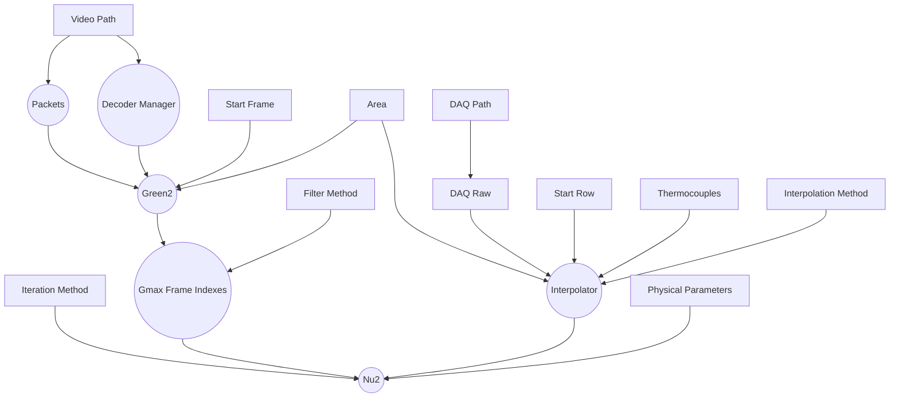
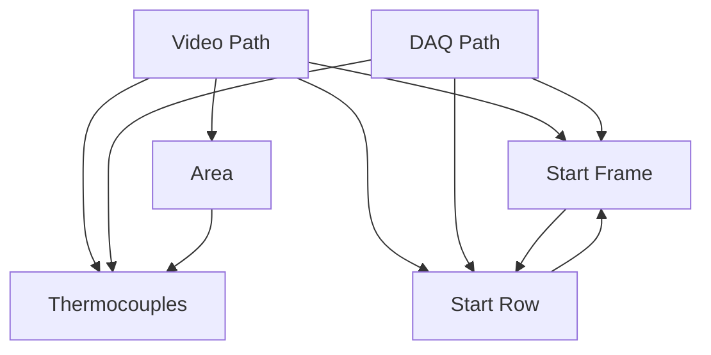
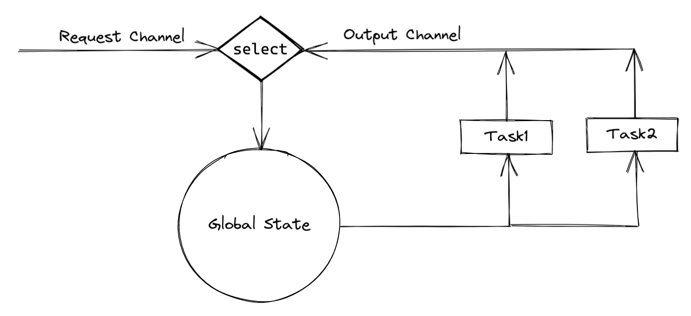
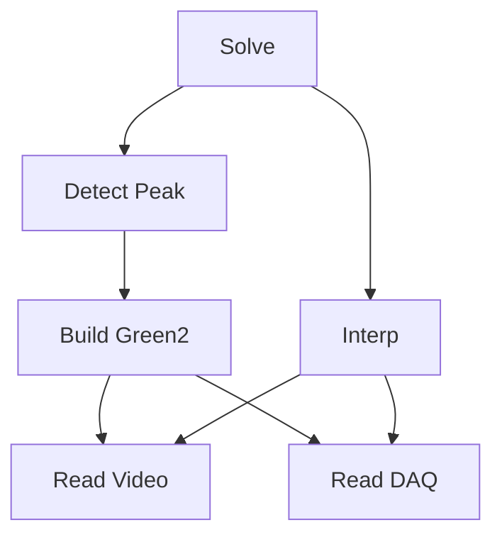
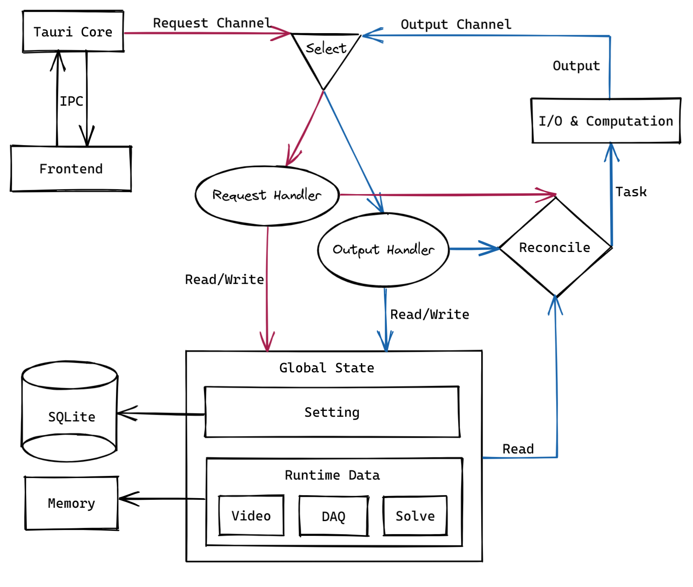

# Transient Liquid Crystal Experiment Data Processing

Built with [Tauri](https://tauri.app).

## Development
### Linux
- install rust nightly-x86_64-unknown-linux-gnu toolchain
- install [Nix](https://nixos.org/) and enable [Flake](https://nixos.wiki/wiki/Flakes), this will manage all other dependencies.
```sh
# enter the environment
nix develop # or use direnv

# run
cargo tauri dev

# build
cargo tauri build
```
Cross compile to Windows(TODO).

### Windows(TODO)
- install rust nightly-x86_64-pc-windows-msvc toolchain
```sh
# install tauri-cli
cargo install tauri-cli

# install `ffmpeg` via `vcpkg`, need to compile for about 20 mins

# let vcpkg expose ffmpeg headers

# install `llvm`

# install `cargo-vcpkg`
```

## Architecture
### `f(Setting) -> Data`
`Setting`为由用户指定的设置，`Data`为计算结果。整体上是pure evaluation，即同样的`Setting`必然得到同样`Data`。具体实现上则会引入状态：
- `Setting`有多项，`Data`有多个中间结果
- `Data`的不同中间结果分别依赖`Setting`中的不同项
- `Setting`中的不同项之间存在逻辑关联
- `Setting`由用户逐步构建，需要尽可能的计算出所有已经可以计算的中间结果，以及当该结果所依赖的`Setting`项变化时重新计算

整个计算过程可以看作是实际`Data`逐步向当前`Setting`所映射的`Data`动态收敛的过程。

`Data`对`Setting`的依赖关系如下图所示(方框：`Setting`，圆框：`Data`)：


`Setting`内部各项之间的逻辑依赖如下图所示：


任何一项`Setting`改变，所以与其关联的`Setting`项都需要更新，进而所有依赖这些`Setting`项的下游`Data`都需要重新计算。

### 多线程下的状态管理
全局状态`GlobalState`为`Setting`和`Data`的总和。
首先主进程需要保持responsive，所有耗时任务(I/O & CPU intensive task)都要在其他线程执行，必然需要一定程度上让多线程共享`GlobalState`。
如果worker线程直接持有`GlobalState`的引用，则需要通过锁访问。
1. 如果计算过程中持有锁，会影响主线程对于`GlobalState`的读写，不能接受
2. 如果计算过程中不持有锁，则计算完成后根据结果修改`GlobalState`时，由于状态可能已经改变，计算结果已经不再有效，因此需要检验
3. 由于`GlobalState`内不同模块的依赖关系较为复杂，拆分加锁难以保证状态的正确性（一把大锁）
这里采用以`channel`为核心的架构：
1. 主线程为单一事件循环，监听(通过`Request Channel`)来自用户的事件
2. 主线程可读写`GlobalState`，并根据当前状态做出决策，具体的执行全部在另外的`worker`线程
3. `worker`线程只会持有其任务所需的数据，size较小的数据copy，较大的数据通过线程安全的引用计数获得一个只读引用。计算完成后将结果以及该结果的依赖快照发送到`Output Channel`
4. 主线程同时监听(`select`)`Output Channel`，收到`Output`后，根据结果的依赖快照与当前`GlobalState`检验，如果结果依然有效则修改状态，否则丢弃



### 生成计算任务执行计划
计算依赖图：

每一个节点有0或多个前置节点，当所有前置节点都已计算完毕，则根据当前`GlobalState`求值该节点的任务执行计划：
```rust
enum TaskState {
    AlreadyCompleted,
    ReadyToGo(Task),
    DispatchedToOthers,
    CannotStart { reason: String },
}

fn eval_task(&GlobalState) -> TaskState
```
当前置节点未完成计算时，`eval_task`不需要执行，因此是惰性求值：
```rust
struct LazyEvaluator<'a> {
    expr: &'a dyn Fn() -> TaskState,
    value: Option<TaskState>,
}
```
依赖图用二维数组表示，从终节点递归遍历得到当前所有可以执行的任务执行计划`Task`：
```rust
fn eval_tasks(&self) -> Vec<Task>
```
在判断前置条件时不短路返回，可得出多个互不依赖的任务。
当有主事件循环接收到
1. 修改状态的 `Request`
2. 有效的`Output`

时会触发一次`reconcile`，调用`eval_task`得到available的`Task`并为每一个`Task`开一个worker线程：
```rust
for task in global_state.eval_tasks() {
    global_state.spawn_execute_task(task);
}
```

`TaskRegistry`负责控制不产生重复的无效任务
```rust
struct TaskRegistry {
    last_task_ids: [Option<Arc<TaskId>>; NUM_TASK_TYPES],
}
```

### 其他

#### 丝滑进度条
When user drags the progress bar quickly, the decoding can not keep up and there will be a significant lag. Actually, we do not have to decode every frames, and the key is how to give up decoding some frames properly. The naive solution to avoid too much backlog is maintaining the number of pending tasks and directly abort current decoding if it already exceeds the limit. But FIFO is not perfect for this use case because it's better to give
priority to newer frames, e.g. we should at least guarantee decoding the frame where the progress bar **stops**.
`ring_buffer` is used to automatically eliminate the oldest frame to limit the
number of backlog frames.
`task_dispatcher` is a spmc used to trigger multiple workers.
```rust
ring_buffer: ArrayQueue<(Arc<Packet>, oneshot::Sender<Result<String>>)>,
task_dispatcher: Sender<()>,
```
#### 控制流单向依赖
- `worker`线程留下一个引用计数用于异步取消
#### 优先状态重建
- 充分利用RAII，优先采用状态的销毁和重建，而非维护和复用

## References
- [Taking Advantage of Auto-Vectorization in Rust](https://www.nickwilcox.com/blog/autovec)
- [Async: What is blocking?](https://ryhl.io/blog/async-what-is-blocking/)
- [FFmpeg: Difference Between Frames and Packets](https://stackoverflow.com/questions/53574798/difference-between-frames-and-packets-in-ffmpeg)
- [FFmpeg: multithread decoding](https://www.cnblogs.com/TaigaCon/p/10220356.html)
- [Data as a mediator between computation and state](https://www.tedinski.com/2018/08/28/using-data-to-mutate-state.html)
- [Matklad's reply on reddit](https://www.reddit.com/r/rust/comments/uf7yoy/comment/i6s4b8x/)
